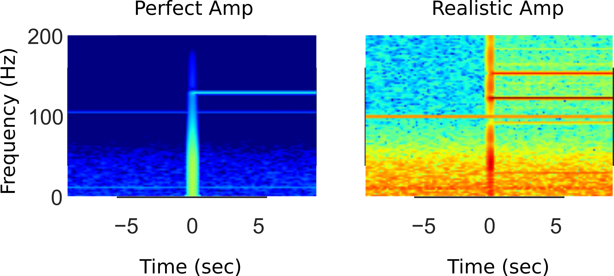
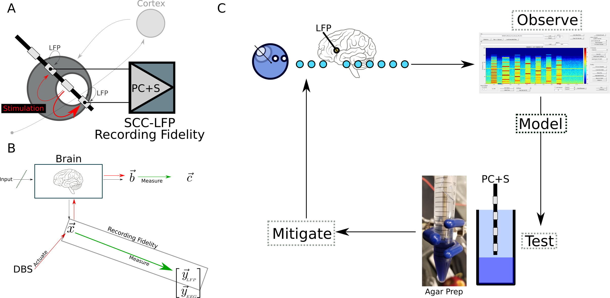

# Differential LFP Simulation Library
Author: Vineet Tiruvadi

## Overview
All recordings are noisy.
Recordings of neural activity, which is subtle compared to all the noise surrounding it, can be particularly challenging.
Add in active stimulation and the problem seems to become intractable.

Modern clinical devices have started using *differential* recordings of local field potentials (LFPs) in brain regions to capture large scale, synchronous neural activity by rejecting noise that is recorded equally in both recording channels.
This approach shows promise in clinical studies, but several preprocessing steps must be applied to recordings before reliable estimates of neural oscillations can be identified.

In this notebook we talk about a noise process called *mismatch compression* that can arise in differential LFP recordings.
We use a combination of real world recordings, in both patients and on benchtops, and simulated dLFP recordings to characterize and correct for mismatch compression in clinical recordings.

## Installation
### Dependencies
Oscillatory analyses depend on a separate library called DBSpace, available here:

## Notebook
A provided notebook enables interactive adjustment of the stimulation parameters.

## Methods

